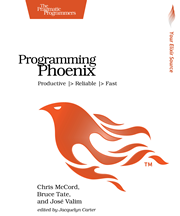

```
Roberto Nogueira  BSd EE, MSd CE
Solution Integrator Experienced - Certified by Ericsson
```

# Programming Phoenix



## Table of Contents

```
Table of Contents

1. Introducting Phoenix
[x] Fast
[x] Concurrent
[x] Beautiful Code
[x] Interactive
[x] Reliable
[x] Is This Book for You?
[x] Online Resources

2. The Lay of the Land
[x] Simple Functions
[x] Installing Your Development Environment
[x] Creating a Throwaway Project
[x] Building a Feature excerpt
[ ] Going Deeper: The Request Pipeline
[ ] Wrapping Up

3. Controllers, Views, and Templates
[ ] The Controller
[ ] Creating Some Users
[ ] Building a Controller
[ ] Coding Views
[ ] Using Helpers
[ ] Showing a User
[ ] Wrapping Up

4. Ecto and Changesets
[ ] Understanding Ecto
[ ] Defining the User Schema and Migration
[ ] Using the Repository to Add Data
[ ] Building Forms
[ ] Creating Resources
[ ] Wrapping Up

5. Authenticating Users
[ ] Preparing for Authentication
[ ] Managing Registration Changesets
[ ] Creating Users
[ ] The Anatomy of a Plug excerpt
[ ] Writing an Authentication Plug
[ ] Implementing Login and Logout
[ ] Presenting User Account Links
[ ] Wrapping Up

6. Generators and Relationships
[ ] Using Generators
[ ] Building Relationships
[ ] Managing Related Data
[ ] Wrapping Up

7. Ecto Queries and Constraints excerpt
[ ] Adding Categories
[ ] Diving Deeper into Ecto Queries
[ ] Constraints
[ ] Wrapping Up

8. Testing MVC
[ ] Understanding ExUnit
[ ] Using Mix to Run Phoenix Tests
[ ] Integration Tests
[ ] Unit-Testing Plugs
[ ] Testing Views and Templates
[ ] Splitting Side Effects in Model Tests
[ ] Wrapping Up

9. Writing Interactive and Maintainable Applications
[ ] Watching Videos
[ ] Watching Videos
[ ] Adding JavaScript
[ ] Creating Slugs
[ ] Wrapping Up

10. Using Channels
[ ] The Channel
[ ] Phoenix Clients with ES6
[ ] Preparing Our Server for the Channel
[ ] Creating the Channel
[ ] Sending and Receiving Events
[ ] Socket Authentication
[ ] Persisting Annotations
[ ] Handling Disconnects
[ ] Wrapping Up

11. OTP
[ ] Managing State with Processes
[ ] Building GenServers for OTP
[ ] Supervision Strategies
[ ] Designing an Information System with OTP
[ ] Building the Wolfram Info System
[ ] Wrapping Up

12. Observer and Umbrellas
[ ] Introspecting with Observer
[ ] Using Umbrellas
[ ] Wrapping Up

13. Testing Channels and OTP
[ ] Testing the Information System
[ ] Isolating Wolfram
[ ] Adding Tests to Channels
[ ] Authenticating a Test Socket
[ ] Communicating with a Test Channel
[ ] Wrapping Up

14. What’s Next?
[ ] Other Interesting Features
[ ] What’s Coming Next
[ ] Good Luck
```
